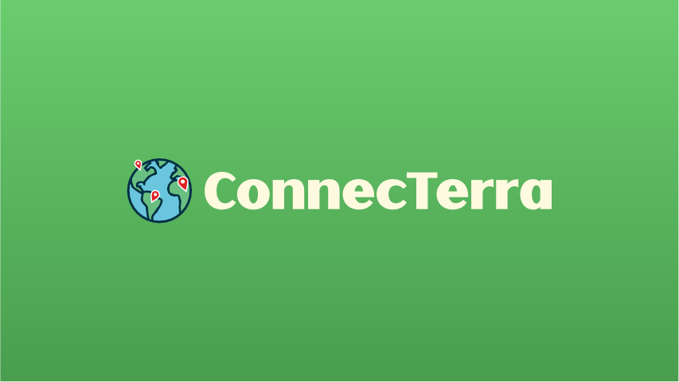

# ConnecTerra - Sustentabilidade como pilar da conexão

## Contexto
O ConnecTerra é um projeto integrador do programa **Bolsa Futuro Digital** do Governo Federal em parceria com a SOFTEX Pernambuco. 

Carinhosamente chamado de CT, o projeto visa ser uma plataforma de facilitação de certificações dos chamados "selos verdes", que são certificados de práticas de produções rurais sustentáveis. Com essa plataforma, os produtores de pequeno e médio porte conseguem se informar mais sobre os certificados e serem listados e reconhecidos como produtores rurais oficialmente ceritificados, assim podendo se conectar com consumidores conscientes e preocupados com a origem sustentável do produto. 

## Organização do projeto

O projeto está divido em 1 diretório raiz, chamado de connecterra, e 3 diretórios app, chamados de pagina_inicial, onde estão contidos os templates e a lógica da homepage, produtores, onde está a lógica de cadastro, login, catálogo e dashboard de usuário, e selosverdes, onde está a modelagem das tabelas do BD das informações das ceritificações. Também temos diretório images que estão as imagens de concepts arts da identidade visual da plataforma e o diretório static que contém todos os estáticos do site. Ainda, há um arquivo de requirements contendo todas as bibliotecas necessárias para rodar o código. Além disso, também há uma aba de admin na aplicação em que é possível administrar todo o BD do sistema. 

## Status atual e informações técnicas
FINALIZADO ✅

Ferramentas utilizadas:
- backend: python e django
- frontend: html, css e javascript
- versionamento: Git & Github
- banco de dados nativo do django (sqlite3)

# Como clonar e rodar código localmente
Abra seu terminal ou prompt de comando e clone o projeto do GitHub:

    git clone https://github.com/msiqueiras/ConnecTerra.git
    cd ConnecTerra

## Configurar ambiente virtual

    python -m venv <nome_ambiente>
    source <nome_ambiente>/bin/activate (LINUX)

## Instalar dependências e executar

    pip install -r requirements.txt
    python manage.py runserver

## Acessar o Projeto no navegador

Após rodar o comando, o servidor estará ativo.

- Endereço base: O site geralmente será acessível localmente em: http://127.0.0.1:8000 
